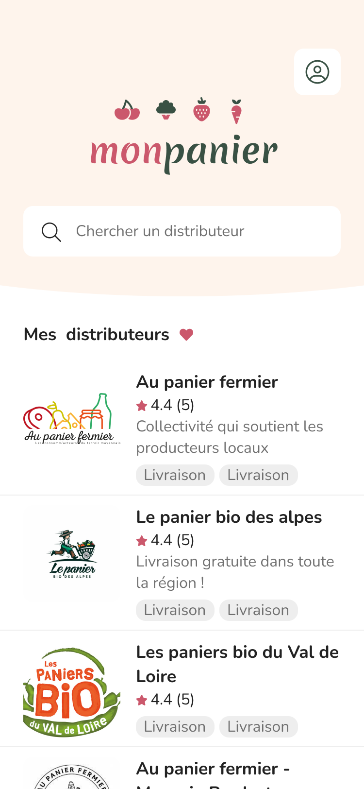
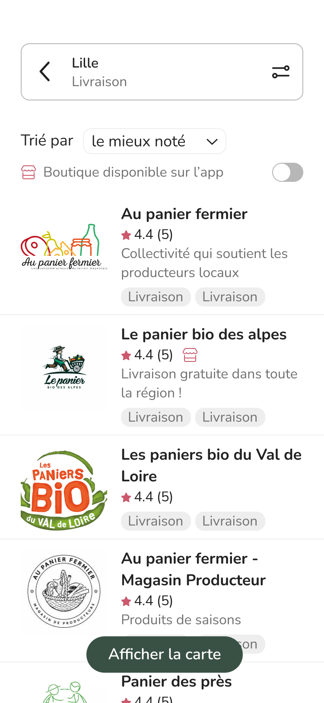
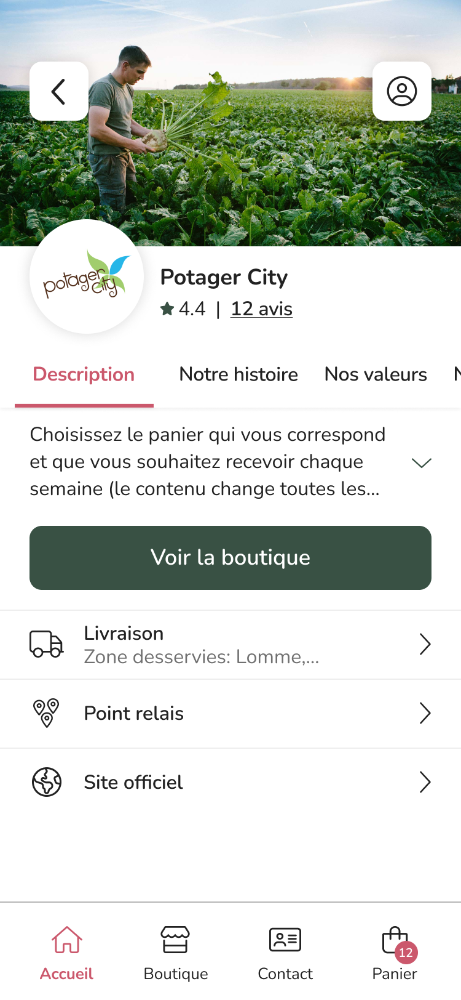
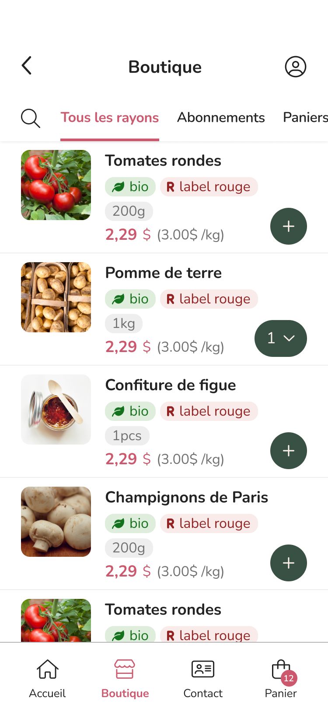

# monpanier
E-commerce platform for French local products.

MONPANIER is a platform for buying and selling local products in France, mainly food products that have been produced in accordance with ethical and environmental standards. This platform provides tools and services to facilitate the management of producers and organizers of short distribution circuits.

    
    
    
    

[Landing page](https://monpanier.app/)
[Figma](https://www.figma.com/file/1o5wSNJooIAmzh9BqtYrec/Design-system?node-id=1364%3A4128&t=S7TUst0Puuvn002S-1)
[Demo]https://www.figma.com/proto/1o5wSNJooIAmzh9BqtYrec/Design-system?node-id=1288%3A2043&scaling=scale-down&page-id=420%3A283&starting-point-node-id=1265%3A4084&show-proto-sidebar=1
